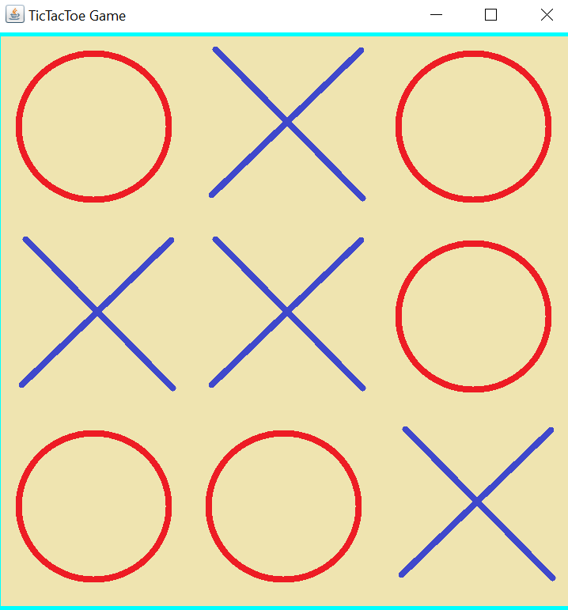
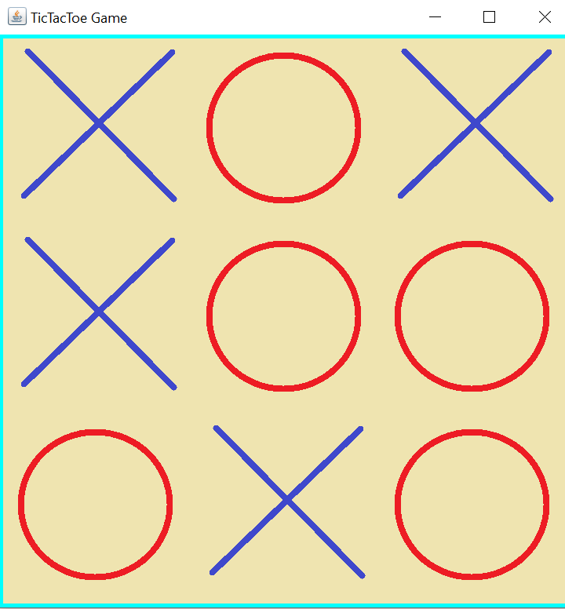
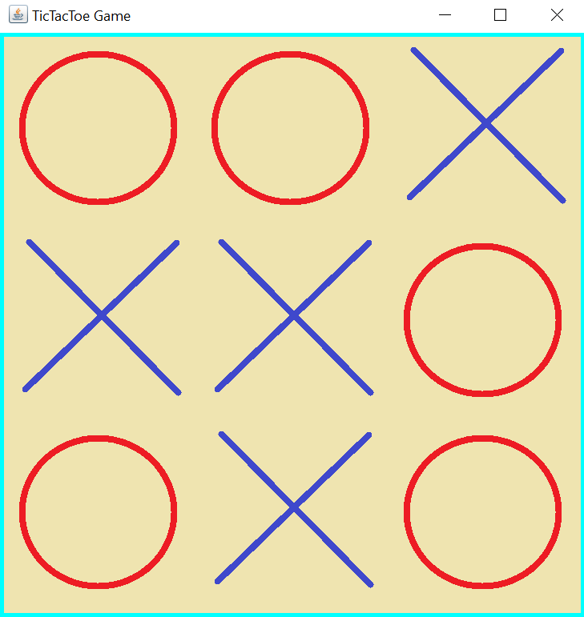

## TicTacToe-Minimax

### Introduction

This project allows users to play TicTacToe against an AI which uses minimax algorithm to determine the next move. It is entirely made in Java.
With this algorithm it was impossible to win a single game against the AI.
 

| Game Result 1 | Game Result 2 | Game Result 3 |
| --- | --- | --- |
| |  ||

### Minimax Algorithm

         public int minimax(int board[][],int depth,boolean max_step){
                int result=this.end_game();
                //If the game is already ended the score is the result.
                if(result!=2){
                    return result;
                }
                if(max_step==true){
                    int bestScore=-1000;
                    for(int i=0; i<3; i++){
                        for(int j=0; j<3; j++){
                            if(board[i][j]==0){
                                board[i][j]=-1;
                                int score=this.minimax(board,depth+1,false);
                                board[i][j]=0;
                                if(score>bestScore){
                                    bestScore=score;
                                }
                            }
                        }
                    }
                    return bestScore;
                }
                else{
                    int bestScore=1000;
                    for(int i=0; i<3; i++){
                        for(int j=0; j<3; j++){
                            if(board[i][j]==0){
                                board[i][j]=1;
                                int score=this.minimax(board,depth+1,true);
                                board[i][j]=0;
                                if(score<bestScore){
                                    bestScore=score;
                                }
                            }
                        }
                    }
                    return bestScore;
                }
            }
            
            public void minimax_choice(){
                int bestScore=-1000;
                int[][] board=new int[3][3];
                board=this.gameboard;
                Position bestChoice=new Position(0,0);
                for(int i=0; i<3; i++){
                    for(int j=0; j<3; j++){
                        if(board[i][j]==0){
                            board[i][j]=-1;
                            int score=this.minimax(board,0,false);
                            board[i][j]=0;
                            if(score>bestScore){
                                bestScore=score;
                                bestChoice=new Position(i,j);
                            }
                        }
                    }
                }
                this.gameboard[bestChoice.x][bestChoice.y]=-1;
                return;
            }

### Execution 

You can execute it directly by opening the TicTacToe.jar file or from the command line typing:

* *java -jar "TicTacToe.jar"* 

